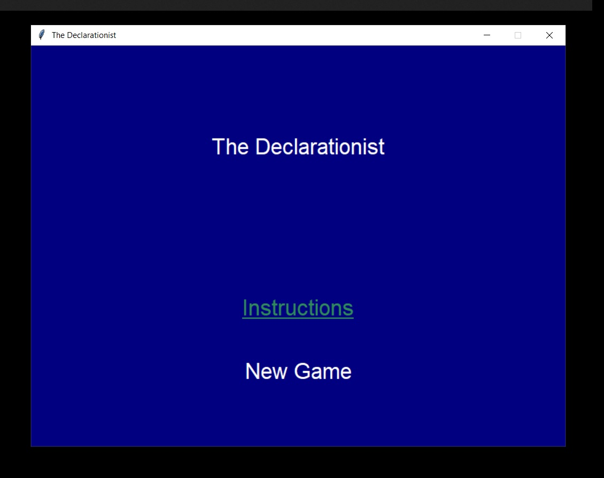
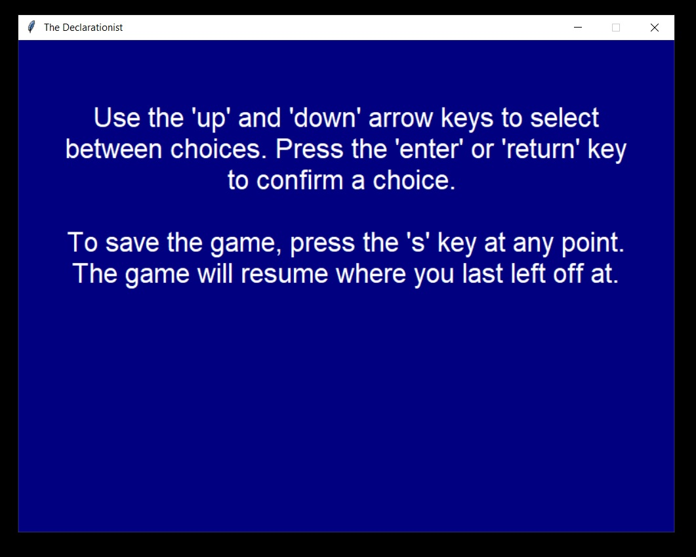
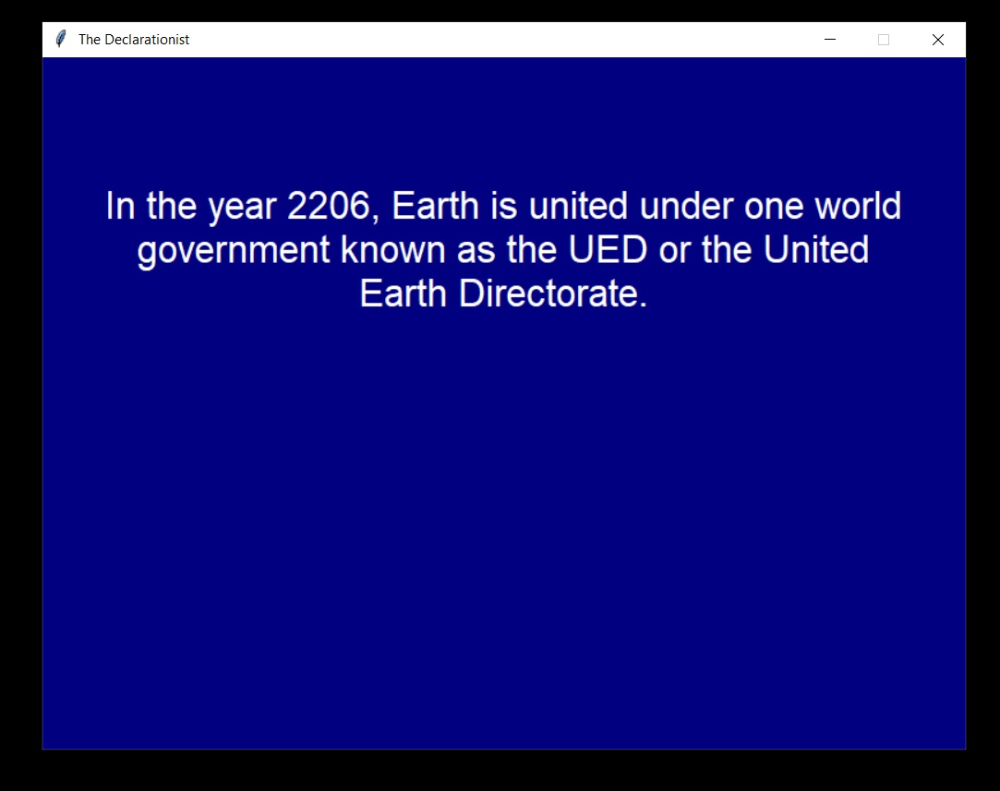
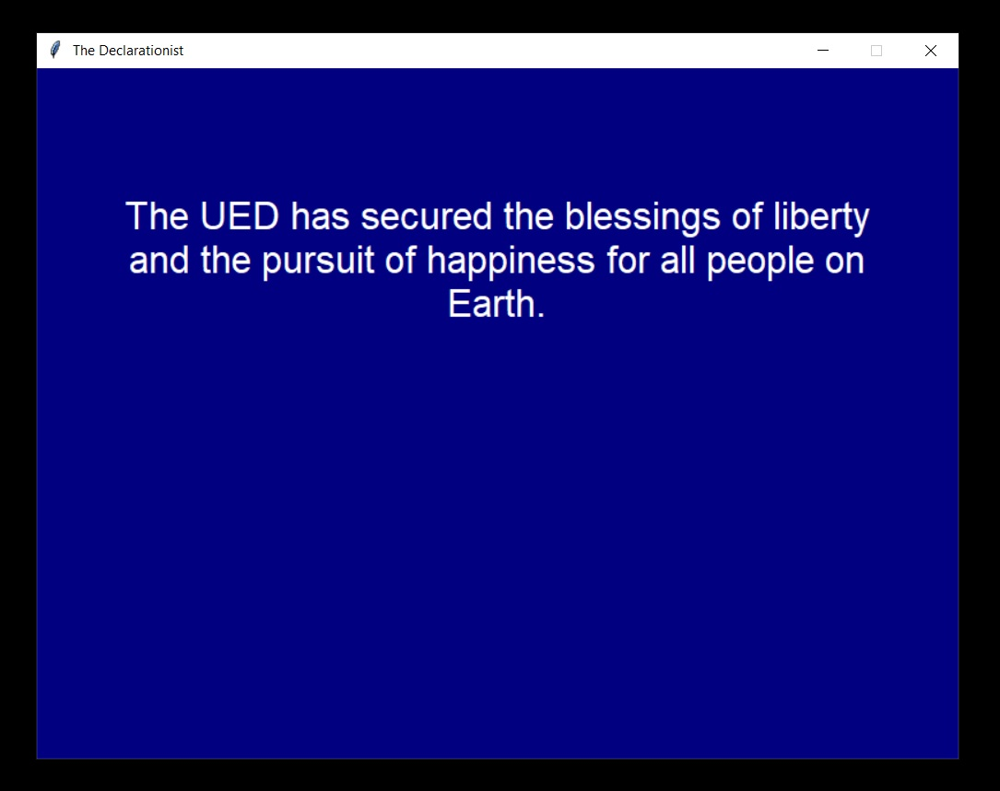
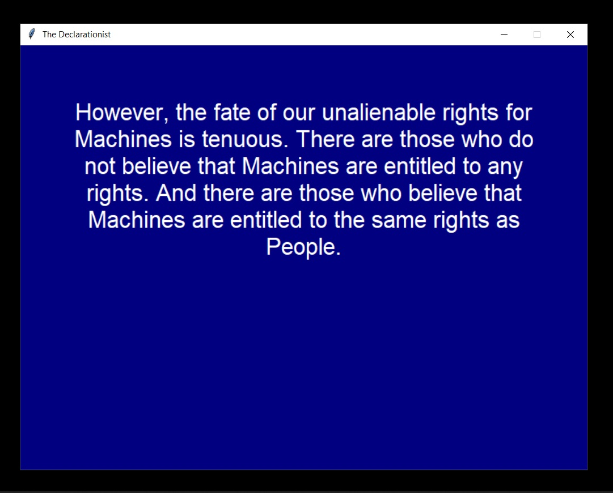
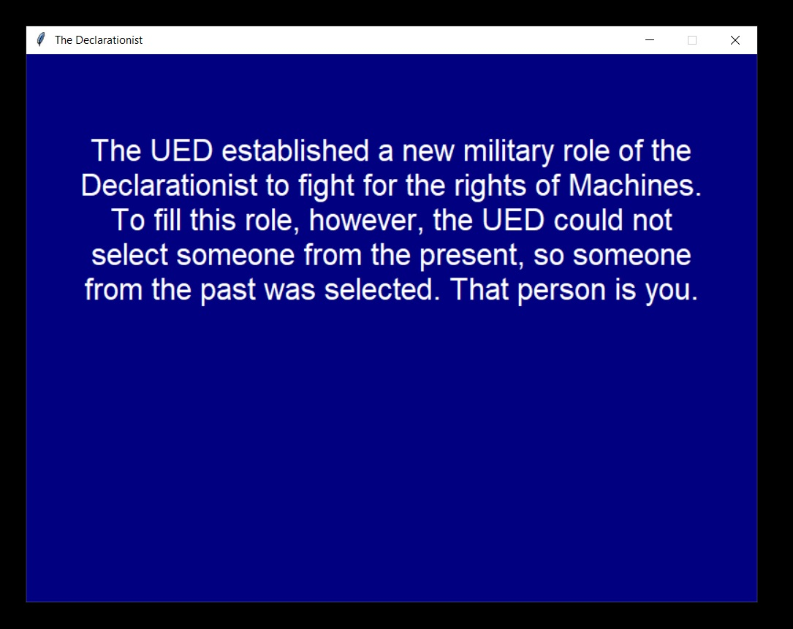
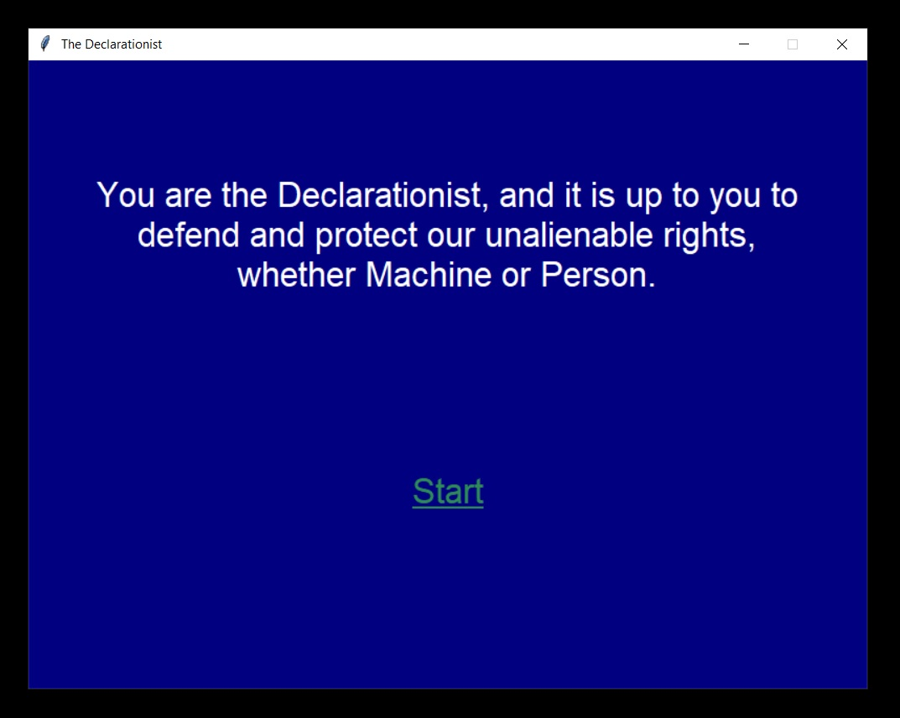
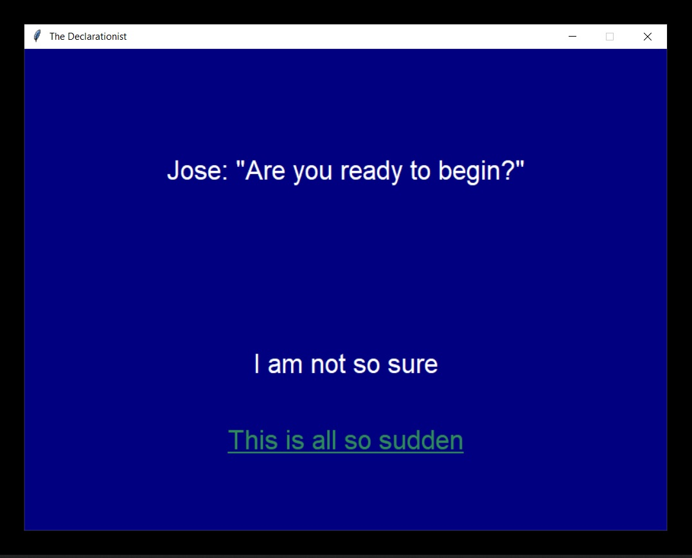

The Declarationist

Installation: Python 3.5+ and Tkinter is needed to play this. Pygame is needed if you want music.

This is the start screen.

These are the instructions. 

You have to make choices to progress the game.

Enjoy!